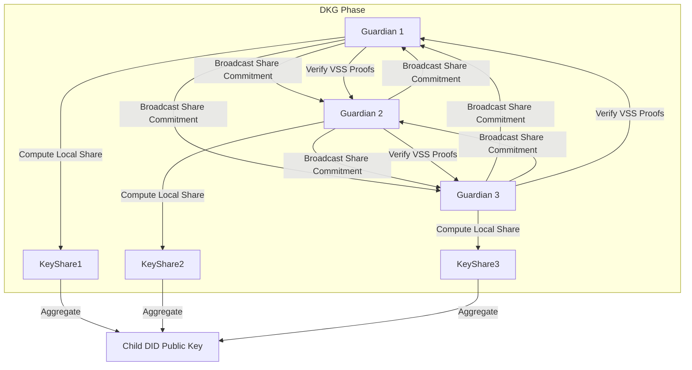

Let’s face it: keeping a child’s digital identity secure, private, and actually usable isn’t exactly straightforward. Especially when multiple guardians are involved, possibly spread across different devices or even borders. How do we pull it off without creating a single point of failure—or worse, exposing sensitive secret keys? As kids grow from prenatal care all the way to entering the workforce, governments have to balance the **best interests of the child** with the messy, real-world dynamics of families. Traditional key management just doesn’t cut it here. Handing one private key to a single guardian is a recipe for loss, coercion, or misuse. And dumping everything into a centralized database? That’s just building a honeypot for attackers.

This is where **multi-party computation (MPC) for guardian co-signing** steps in. By leaning on MPC, we can design **minor DVC wallets** where cryptographic authority is actually shared. Nobody holds the full key alone. No secret material ever shows up in plaintext during operations. Instead, guardians work together—using cryptographic protocols that enforce consensus, respect veto rights, and keep data aggregation private—to issue, update, or present credentials.

In this post, we’ll break down the technical and policy architecture behind putting MPC to work in child-centric digital identity systems. We’re looking at **distributed key generation (DKG)** algorithms, efficient signature aggregation methods like **MuSig**, and architectural patterns for **dynamic guardian sets** and **veto-based consent mechanisms**. And we’re grounding all of this in open standards, interoperability principles, and a firm commitment to child rights and data protection.

## The Imperative for Multi-Party Computation in Minor Digital Identity

If you’ve spent any time in the development sector, you’ve likely run into those frustrating "identity gaps"—places where kids lack formal recognition, or where the systems that do exist are incredibly brittle. To fix this, a solid digital identity system for minors needs to juggle three pretty conflicting requirements:

1.  **Availability:** Services need to stay accessible even if one guardian’s offline, stuck in traffic, or just lost their phone.
2.  **Security:** The whole setup has to stand up to coercion, theft, and insider threats. Nobody should be able to compromise a kid’s identity on their own.
3.  **Privacy:** We need to minimize the child’s data footprint, and frankly, guardianship relationships shouldn’t be broadcasted to every verifier that asks.

MPC tackles this by mathematically spreading out trust. Unlike basic threshold signatures (where a central dealer usually hands out the shares), MPC lets guardians generate those shares together. That wipes out the "dealer" trust assumption entirely, which perfectly aligns with the government’s actual role: setting policy, not hoarding secrets.

From a human rights angle, this backs up **Article 16 of the UN Convention on the Rights of the Child (Right to Privacy)** and **Article 7 (Right to Identity)**. By making sure secret keys never sit in one place, we shrink the attack surface. It also lets guardians act as stewards of their child’s digital rights without carrying the entire weight of key custody on their shoulders.

> **Interoperability Note:** MPC implementations must operate within the **4 layers of interoperability**.
> *   *Technical:* MPC protocols must support W3C Verifiable Credentials and DIDs.
> *   *Semantic:* Schemas must define "Guardian" roles and consent policies.
> *   *Organizational:* Government agencies must agree on guardian validation workflows.
> *   *Policy:* Legal frameworks must recognize MPC-generated signatures as valid for official acts.
>
> For a broader survey of these frameworks, see our analysis on [architecting the minor-centric DVC ecosystem](posts/2026-05-04-architecting-the-minor-centric-dvc-ecosystem-a-technical-survey-of-standards-privacy-mechanisms-and-governance-frameworks/).

## Distributed Key Generation: Building the Foundation Without Secrets

At the heart of MPC co-signing sits **Distributed Key Generation (DKG)**. In a minor DVC context, DKG lets a group of guardians (think parents, legal custodians, or trusted community elders) team up to create a cryptographic key pair. Everyone gets the public key—which becomes part of the child’s DID—while the private key gets split into shares. The catch? No guardian ever learns the full private key, and nobody holds a single share that could reconstruct it on its own.

### Algorithms for Child-Friendly DKG

For government deployments, we recommend **Pedersen DKG** combined with **Feldman's Verifiable Secret Sharing (VSS)**. This combination provides:

*   **Robustness:** Protocols can detect and exclude faulty or malicious guardians during setup.
*   **Scalability:** Efficient for sets of 3 to 7 guardians, typical in family structures.
*   **Open Source Maturity:** Well-supported by libraries like `libsnark` or MPC-specific frameworks like `Frost`.

**Concrete Example: Birth Credential Issuance**
Picture a newborn in a remote clinic. The mom, dad, and a community health worker (stepping in as a witness guardian) hop into a DKG ceremony through a secure mobile app.
1.  Each guardian generates a secret share and broadcasts encrypted commitments.
2.  Guardians verify each other's commitments using VSS proofs.
3.  The aggregate public key is derived. This key is associated with the child's DID in the Civil Registry.
4.  The birth credential is issued to the child's wallet. To present this credential later, any threshold (e.g., 2-of-3) guardians must collaborate.

This process ensures that the key generation is resilient. If the father's device is compromised, the attacker only gets one share, which is useless without others. This aligns with resilient key management patterns we discussed regarding [threshold cryptography and social recovery](posts/2026-05-05-resilient-key-management-for-minor-identities-threshold-cryptography-social-recovery-patterns-and-long-term-did-sustainability/).

### DKG Protocol Flow



### Code Snippet: Simplified Share Verification

Below is a conceptual Python snippet demonstrating how a guardian verifies a share commitment. In production, this would use constant-time cryptographic libraries to prevent side-channel attacks.

```python
def verify_share_commitment(public_commitment, share, generator_g, generator_h, challenge):
    """
    Verifies that a received share corresponds to the public commitment.
    Uses Schnorr proof verification logic adapted for VSS.
    """
    # g and h are generators of a cyclic group (e.g., elliptic curve)
    # commitment = g^share * h^blinding_factor
    
    # Compute expected commitment from share
    # Note: In real VSS, this involves Lagrange interpolation and polynomial checks
    # This is a simplified representation for educational purposes.
    
    computed_commitment = scalar_mul(generator_g, share)
    
    # Verify against the broadcast commitment
    if computed_commitment == public_commitment:
        return True
    else:
        return False

# Guardians call this for each other's shares before accepting the DKG result
is_valid = verify_share_commitment(guardian_b_commitment, received_share_b, G, H, challenge_b)
```

## Secure Signature Aggregation and MuSig: Efficiency Meets Privacy

Once the key is split up, guardians still need to sign things (like credential updates or presentation requests) without ever piecing the private key back together. That’s where **secure signature aggregation** comes in. Among the options on the table, **MuSig** really shines for minor DVC wallets thanks to its efficiency and flexibility.

### Why MuSig for Minors?

*   **Bandwidth Efficiency:** MuSig rolls everything into a single aggregated signature that looks just like a standard Schnorr signature. This is a game-changer in low-bandwidth areas common in ICT4D work. It trims down the payload size for verifiers, which really helps optimize network traffic.
*   **Pre-Signing Flexibility:** MuSig supports "pre-signing" rounds. Guardians can handle partial computations offline or asynchronously, then finalize the signature only when it’s actually needed. (This is a huge usability win for caregivers dealing with spotty connectivity.)
*   **Privacy:** The aggregated signature doesn’t reveal which guardians actually participated, keeping the guardianship structure out of the spotlight.

For more on optimizing network performance in credential exchanges, refer to our guide on [optimizer verifiable presentation exchange for minors](posts/2026-05-05-optimizing-verifiable-presentation-exchange-for-minors-lightweight-cryptography-bandwidth-efficient-protocols-and-edge-wallet-deployment/).

### MuSig Aggregation Logic

In a 2-of-3 setup, if Guardians A and B agree to sign, they run through a quick two-round protocol:

1.  **Nonces Generation:** Each guardian generates random nonces and commits to them.
2.  **Aggregation:** Guardians aggregate nonces and compute a combined public key for this signing session.
3.  **Partial Signatures:** Each guardian computes a partial signature using their share and the aggregated nonce.
4.  **Finalization:** Partial signatures are summed to produce the final signature.

This process ensures that even if one guardian is malicious, the signature remains valid only if the threshold is met, and the malicious guardian learns nothing about the other shares.

## Veto-Based Consent Mechanisms: Empowering Guardians and Protecting Children

When it comes to child protection, one non-negotiable feature is the ability to actually stop unauthorized actions. **Veto-based consent mechanisms** let any guardian block a transaction—say, the release of sensitive health data or an update to educational records. This isn’t just a technical checkbox; it’s a real-world safeguard against abuse and exploitation.

### Implementing Veto in MPC

Technically speaking, a veto in MPC just means bailing out of the signature aggregation protocol. If Guardian C disagrees with a request to disclose the child's immunization history to a third party, they simply refuse to contribute their partial signature. The aggregation fails, and the credential isn’t presented. Problem solved.

Of course, we have to walk a fine line between availability and veto power. A hard veto can easily turn into a denial of service if a guardian just goes ghost. To handle that:

*   **Timed Vetoes:** The protocol can include a timeout. If a guardian doesn’t respond within a policy-defined window, the system might treat the silence as a non-veto, or escalate to a government authority for arbitration.
*   **Weighted Vetoes:** Certain guardians (like a court-appointed one) might hold "hard veto" rights, while others get "soft veto" rights that can be overridden by a super-majority in genuine emergencies.

### Dynamic Guardian Sets and Lifecycle Management

Let’s be real: guardianship changes. Divorce, passing, or the kid simply growing up all shift the dynamic. MPC architectures need to support **dynamic threshold updates** without forcing a complete re-issue of every credential.

*   **Key Rotation via Re-Sharing:** Guardians can run a re-sharing protocol to update shares. Old guardians drop out, new ones step in, and the public key stays exactly the same. This preserves the child's DID continuity.
*   **State Machine Transitions:** The wallet can run a state machine that governs access policies. As the child ages, thresholds or veto rights can evolve. (For instance, at 13, the kid might gain "co-signer" status, meaning their consent is required for non-sensitive updates.)

This lifecycle management is essential for long-term sustainability. We explored similar automation for the age-of-majority transition in our post on [automating the age-of-majority transition](posts/2026-05-05-automating-the-age-of-majority-transition-time-locked-key-rotation-state-machine-transitions-for-control-transfer-and-zero-knowledge-proof-of-adulthood-in-minor-dvc-wallets/).

Furthermore, verifying the relationship between guardians and the child without exposing personal data is vital. Zero-knowledge proofs can attest to guardianship status. See [zero-knowledge guardianship attestation](posts/2026-05-05-zero-knowledge-guardianship-attestation-cryptographic-proofs-of-relationship-selective-disclosure-of-authority-and-privacy-preserving-guardian-verification-in-minor-dvcs/) for techniques to prove authority while preserving privacy.

## Architectural Patterns for Government Implementation

If governments are stepping in as the authoritative trusted parties, here are a few architectural patterns that actually work in the real world.

### 1. Policy-Enforced MPC Orchestration

You’ll want an MPC protocol that’s guided by a policy engine, one that strictly enforces government rules. Open Policy Agent (OPA) can be plugged in to evaluate requests before the MPC rounds even start.

*   *Pattern:* Request arrives → OPA checks policy (e.g., "Is this guardian authorized?" "Is this data type allowed?") → If allowed, trigger MPC round → Aggregate signature → Return result.
*   *Benefit:* Separates cryptographic logic from policy logic, allowing agile updates to consent rules without changing code.
*   *Reference:* Learn more about [decentralized policy enforcement for minor DVC access](posts/2026-05-05-decentralized-policy-enforcement-for-minor-dvc-access-opa-integration-real-time-consent-auditing-and-context-aware-attribute-release-controls/).

### 2. Hybrid Trust Models with TEEs

MPC distributes trust, sure, but what if the guardians' devices are compromised? Integrating **Trusted Execution Environments (TEEs)** on those devices adds a hardware-backed safety net.

*   *Pattern:* MPC shares are stored and processed within the TEE. The OS can't read the shares. Signature aggregation happens inside the enclave.
*   *Benefit:* Protects against malware and ensures that even if the device is seized, the secret shares remain isolated.
*   *Reference:* See our analysis on [trusted execution environments for minor DVC wallets](posts/2026-05-05-trusted-execution-environments-for-minor-dvc-wallets-hardware-backed-key-isolation-enclave-based-presentation-runtimes-and-development-access-control-policies/).

### 3. Interoperability Anchors

To make sure MPC-based DVCs are verifiable across different sectors, governments need to publish **DID Documents** that clearly specify the verification method type.

*   *Technical Layer:* Use `MpcVerificationKey2024` (proposed type) in DID documents to indicate that verification requires aggregated signatures.
*   *Semantic Layer:* Define JSON-LD contexts for `GuardianSet`, `VetoPolicy`, and `ConsentTimestamp`.
*   *Organizational Layer:* Establish cross-agency agreements for recognizing MPC signatures in health, education, and civil registry systems.

### 4. Runtime Verification and Compliance

MPC protocols are complex and notoriously prone to implementation bugs. Governments should mandate **runtime verification** to keep protocol invariants intact.

*   *Pattern:* Use contract checking tools to monitor MPC rounds. If a deviation is detected (e.g., a share mismatch), the protocol aborts and alerts the government audit log.
*   *Benefit:* Ensures automated compliance and detects anomalies in real-time.
*   *Reference:* Explore [runtime verification and specification-driven security](posts/2026-05-05-runtime-verification-and-specification-driven-security-for-minor-dvcs-contract-checking-invariant-monitoring-and-automated-compliance-auditing/) for implementation details.

## Security, Privacy, and Cybersecurity Considerations

Rolling out MPC in the wild demands a serious security mindset. Here’s what policymakers and tech leads should keep their eyes on:

*   **Denial of Service (DoS):** A malicious guardian could disrupt the signing process by timing out. Implement **fallback mechanisms** where a government node can act as a neutral participant to ensure availability, or use **timeout escalation** to arbitration.
*   **Side-Channel Attacks:** MPC libraries must be resistant to timing and power analysis. Use constant-time implementations.
*   **Quantum Readiness:** As we transition to post-quantum cryptography, MPC protocols must support hybrid signatures. Ensure that DKG and aggregation algorithms can integrate **CRYSTALS-Dilithium** or **FALCON** shares.
    *   *Reference:* Read about [post-quantum cryptographic migration for minor identities](posts/2026-05-05-post-quantum-cryptographic-migration-for-minor-identities-algorithm-agility-hybrid-signature-schemes-and-forward-secure-did-key-rotation/).
*   **Data Minimization:** MPC should not log secret shares. Audit logs must record only metadata (timestamps, guardian IDs, transaction hashes) to support accountability without compromising privacy.
*   **Open Source Audits:** Mandate that all MPC libraries undergo independent security audits. Prioritize solutions with active community support and transparent development.

## Actionable Takeaways and Implementation Roadmap

If you’re a government official or UN specialist looking to push minor DVC systems forward, here’s a practical roadmap for weaving MPC co-signing into your stack.

### Summary Table: MPC Features vs. Child Rights Benefits

| MPC Feature | Technical Benefit | Child Rights / Policy Benefit |
| :--- | :--- | :--- |
| **Distributed Key Generation** | No single point of failure; robust share distribution. | Protects against key loss; ensures identity continuity even if a guardian is unavailable. |
| **Threshold Signatures** | Requires collaboration; prevents single-actor compromise. | Enforces consensus; reduces risk of coercion or unauthorized access by one guardian. |
| **Veto Mechanisms** | Allows abort conditions in protocol. | Empowers guardians to protect child privacy; prevents malicious data disclosure. |
| **Dynamic Sets** | Supports re-sharing and key rotation. | Adapts to life events (divorce, aging); supports evolving capacity of the child. |
| **Signature Aggregation** | Bandwidth efficient; privacy-preserving aggregation. | Enables service access in low-resource settings; hides guardianship structure from verifiers. |

### Steps for Implementation

1.  **Assess Legal Frameworks:** Review national laws to ensure MPC-generated signatures are legally recognized for civil acts. Define the legal status of "guardian" and consent requirements.
2.  **Pilot DKG Workflows:** Start with a pilot for birth registration. Implement DKG for new DIDs, involving parents and a registry officer. Measure usability and security.
3.  **Integrate Policy Engines:** Deploy OPA or similar tools to enforce consent policies. Define veto rights and timeout policies based on stakeholder consultation.
4.  **Adopt Open Standards:** Use W3C Verifiable Credentials and DIDs. Contribute to standards bodies to define MPC-specific verification methods.
5.  **Secure the Supply Chain:** Use audited, open-source MPC libraries. Integrate TEEs on guardian devices where possible.
6.  **Plan for Lifecycle:** Design re-sharing protocols for guardian changes. Automate transitions at key ages (e.g., 13, 16, 18).
7.  **Monitor and Audit:** Implement runtime verification. Conduct regular security audits and privacy impact assessments.

### Interoperability Checklist

*   [ ] **Technical:** MPC protocol supports W3C VC signature suites.
*   [ ] **Semantic:** JSON-LD contexts defined for guardianship and consent.
*   [ ] **Organizational:** Cross-agency agreements on guardian validation.
*   [ ] **Policy:** Legal recognition of MPC signatures and veto rights.

## Conclusion

Multi-party computation really does offer a fresh way to tackle the security puzzle of minor digital identities. By spreading trust across guardians, baking in veto rights, and allowing for smooth lifecycle updates, MPC bridges the gap between raw technical capability and the ethical demands of child protection. It gives governments the tools to roll out services that are actually secure, respect privacy, and leave nobody behind—so every kid can navigate their digital life with dignity.

As we build these out, the focus has to stay on open standards, rock-solid security, and keeping communities in the loop. The future of kids’ digital identity isn’t just about fancy cryptography. It’s about designing systems that respect their rights, grow with them, and lay the groundwork for real empowerment. With MPC, we’ve finally got the right tools to make that vision a reality—creating a space where digital identity works for good, shields the vulnerable, and opens doors for everyone.

*The integration of multi-party computation into minor DVC ecosystems marks a pivotal step toward resilient, rights-respecting digital infrastructure, promising a future where technology safeguards children's identities as seamlessly as it connects them to essential services.*

