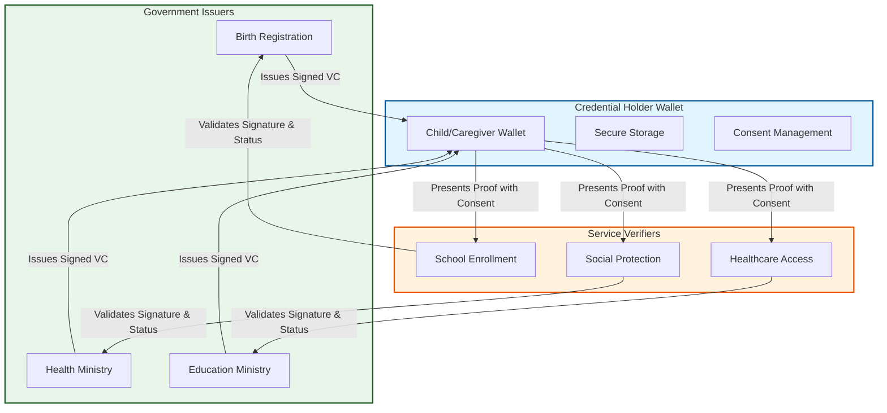

Picture a mother at a rural clinic, trying to prove her child’s vaccination status so they can finally start school. The immunization records? Locked away in an outdated government database. The birth certificate? Sitting in a filing cabinet back at the district office. Meanwhile, the school’s enrollment system demands a digital file the clinic just can’t generate. Suddenly, that child becomes practically invisible to the education sector—facing delayed enrollment, missed health interventions, and a rocky start to life. And this isn’t some rare exception. It’s the everyday reality for millions of kids in developing regions.

Pulling off **verifiable credentials for children** means building a technical architecture that carefully balances **digital identity for minors** with rock-solid **data protection**, privacy safeguards, and basic human rights. With governments and UN agencies racing to digitize public services, the real question has shifted. It’s no longer *whether* we should use digital credentials—it’s *how* we build systems that actually put kids first, from prenatal checkups right through to their first job. In this post, I’m laying out the technical groundwork for exactly that. We’ll walk through the data models, map out who’s involved, and break down the governance frameworks needed to deliver services that are interoperable, secure, and respectful of children’s rights.

## The Urgency: Digital Identity as a Gateway to Rights

Before we get into the technical weeds, let’s ground this in why it actually matters. UNICEF estimates that roughly two-thirds of kids under five don’t have a registered birth. That leaves them effectively invisible to their own governments, and dangerously exposed to exploitation, trafficking, and being shut out of basic services. A digital ID isn’t just paperwork for bureaucrats—it’s a front-row ticket to the rights promised in the Convention on the Rights of the Child (CRC).

The problem? Most traditional digital ID systems just don’t cut it for kids. They tend to hoard data in centralized databases (which are basically bullseyes for hackers), refuse to talk to other sectors, or completely gloss over how consent actually works for minors. **Verifiable Credentials (VCs)** change the game. Built on open standards, VCs let us design child-friendly digital IDs where data moves with the person, can be verified without oversharing, and is managed through rules that actually grow alongside the child.

> **Key Insight:** A child's digital identity should be a key to opportunity, not a chain of surveillance. The architecture must prioritize data minimization, purpose limitation, and the child's evolving capacity.

## Anatomy of a Verifiable Credential for Minors

If we want to build services that actually work for kids, we first need to get comfortable with how the W3C’s Verifiable Credentials framework ticks. Think of a VC less like a row in a spreadsheet and more like a cryptographically sealed digital document—one that can be issued, safely stored, and checked by third parties without everyone needing to trust the same central server.

### Key Actors and Shifting Roles

The whole VC ecosystem revolves around three main players. When we’re talking about children, though, the dynamics get a lot more interesting—especially when it comes to who actually holds the credentials and how we handle consent.

1.  **Issuer:** The organization that mints and cryptographically signs the credential. In government setups, this is usually a ministry or agency that holds the official data. Think Civil Registration (birth certificates), the Ministry of Health (vaccination logs), or Education (academic records).
2.  **Holder:** Whoever stores the credential and shows it to verifiers. For younger kids, this is almost always a **proxy**—a parent, guardian, or legal custodian. But as the child gets older and reaches the age of majority (or shows they’re ready to take charge), control needs to hand over to them. Managing that handoff is a huge part of governance.
3.  **Verifier:** The party asking for proof to make a decision. This could be a school administrator checking enrollment eligibility, a social worker verifying benefits, or a doctor double-checking immunization records.



*Figure 1: Flow of Verifiable Credentials in a child-centric ecosystem. Notice that verification often involves checking the issuer's public key and revocation status, ensuring trust without requiring the verifier to access the issuer's database directly.*

### The Proxy Holder Dilemma

Here’s where things get tricky: the **proxy holder**. In most places, kids can’t legally own digital assets or give consent for data processing. So our systems have to support proxy relationships—letting a guardian step in and present credentials for them. But the architecture also needs a clean exit ramp: as the child grows up, that proxy access has to be revocable. Pulling that off takes flexible identity mappings and thoughtful lifecycle governance, which we’ll dig into next.

## Technical Foundations: Data Models and Interoperability

If government services are going to talk to each other across different sectors, we can’t afford to rely on walled gardens or proprietary file formats. We need to push for **open standards**. They keep systems interoperable, stop vendors from holding us hostage, and actually last. Right now, the W3C Verifiable Credentials Data Model v1.1 is the global go-to—it gives everyone a shared vocabulary to work from.

### W3C Standards and JSON-LD

You’ll usually see VCs formatted in JSON-LD (JavaScript Object Notation for Linked Data). It’s a neat little structure that keeps data organized while letting you link out to external vocabularies and contexts. That flexibility is exactly what makes semantic interoperability possible. Take a basic birth certificate, for instance. The snippet below shows how a credential spells out its type, who issued it, who it’s about, and what data it actually contains.

```json
{
  "@context": [
    "https://www.w3.org/2018/credentials/v1",
    "https://w3id.org/trace/vc-context"
  ],
  "id": "urn:uuid:3978344f-8596-4c3a-a978-8fcaba3903c5",
  "type": ["VerifiableCredential", "BirthCertificateCredential"],
  "issuer": "https://civil-registration.gov.example/issuers/birth",
  "issuanceDate": "2023-10-15T08:30:00Z",
  "credentialSubject": {
    "id": "did:gov:child:abc123xyz",
    "givenName": "Amara",
    "familyName": "Diallo",
    "dateOfBirth": "2023-01-12",
    "placeOfBirth": "Conakry, Guinea",
    "parentIds": [
      "did:gov:parent:parent1",
      "did:gov:parent:parent2"
    ]
  },
  "proof": {
    "type": "Ed25519Signature2018",
    "created": "2023-10-15T08:30:00Z",
    "proofPurpose": "assertionMethod",
    "verificationMethod": "https://civil-registration.gov.example/keys/key-1",
    "jws": "eyJhbGci..."
  }
}
```

*Listing 1: Example of a Verifiable Credential in JSON-LD. The `@context` ensures that any verifier understands the meaning of properties like `givenName` or `dateOfBirth`. The `proof` section provides cryptographic assurance that the credential has not been tampered with and originates from the authoritative issuer.*

### The Four Layers of Interoperability

Rolling out VCs for kids means tackling interoperability on four different fronts. These layers come from the European Interoperability Framework, but they’ve been tweaked to fit development contexts:

1.  **Technical Interoperability:** Can the systems actually exchange data? This covers protocols (like DIDComm or OID4VCI), API standards, and secure transport methods. In low-resource settings, lightweight protocols and offline fallbacks are non-negotiable.
2.  **Semantic Interoperability:** Do both sides mean the same thing when they say the same word? You need shared vocabularies and ontologies. A “vaccination” in the health database has to line up perfectly with “immunization status” in the education portal. Relying on W3C contexts and standard schemas (HL7 FHIR for health, Schema.org for general data) keeps everything from drifting apart.
3.  **Organizational Interoperability:** How do the teams actually work together? Ministries need to agree on data-sharing rules, incident response plans, and who’s responsible for what. If a kid’s health data is being shared with schools for enrollment, those organizational lines have to be crystal clear.
4.  **Policy Interoperability:** Does the law back it up? We’re talking data protection regulations, child rights frameworks, and cross-border recognition deals. The tech has to bend to policy decisions, like how long data gets kept or how consent is tracked.

> **Practical Tip:** Start with a "Minimum Viable Interoperability" approach. Define a core set of credentials (e.g., Birth, Vaccination, School Enrollment) and a shared context before expanding to complex social protection or health records. This reduces risk and builds trust incrementally.

## Privacy, Consent, and the Child's Lifecycle

Privacy is easily the thorniest part of building digital IDs for kids. Children are inherently vulnerable, and their data demands a higher wall of protection. That means baking privacy directly into the architecture from day one—keeping data collection to an absolute minimum, handling consent thoughtfully, and making sure the child’s rights shift naturally as they grow.

### Proxy Holders and Evolving Capacity

You can’t treat consent for kids as a simple yes-or-no switch. It has to mirror **evolving capacity**—the idea that a child’s ability to make decisions grows alongside their age and maturity. Technically, that means your systems need to handle:

*   **Proxy Consent:** Guardians step in to consent to data processing and show credentials on the kid’s behalf. The system needs to cryptographically tie that proxy relationship to the account so no one can piggyback on it.
*   **Age-Gating and Graduated Autonomy:** Hit certain milestones (say, 13, 16, or 18), and the system should automatically shift the reins. The kid might get their own cryptographic keys, while proxy access gets dialed back or revoked entirely.
*   **Revoking Proxy Access:** Life happens. Custody changes, guardians step down, or courts issue new orders. The system has to support smooth, legally compliant transfers of access.

```mermaid
stateDiagram-v2
    [*] --> Prenatal: Birth Registration Initiated
    Prenatal --> Infant: Credential Issued to Proxy Holder
    Infant --> Child: Age 0-12; Proxy Control
    Child --> Adolescent: Age 13-17; Graduated Autonomy
    Adolescent --> Adult: Age 18+; Full Autonomy
    
    state Infant {
        [*] --> ProxyAccess
        ProxyAccess --> DataMinimization: ZKP Proofs
    }
    
    state Child {
        [*] --> ProxyAccess
        ProxyAccess --> SharedControl: Child can view data
    }
    
    state Adolescent {
        [*] --> SharedControl
        SharedControl --> ConsentRequired: Sensitive data requires child consent
    }
    
    state Adult {
        [*] --> FullControl
        FullControl --> KeyRotation: Child manages keys
    }
    
    Infant --> Child: Age Trigger
    Child --> Adolescent: Age Trigger
    Adolescent --> Adult: Age Trigger
```



*Figure 2: State diagram illustrating the lifecycle governance of a child's digital identity. Transitions are triggered by age or legal capacity, shifting control from proxy to the individual.*

### Data Minimization and Zero-Knowledge Proofs

Over-collecting data is one of the biggest threats to kids’ privacy. Honestly, does a school really need to see a child’s entire medical file just to check their shots? No. They just need to know the kid is up to date. Enter **Zero-Knowledge Proofs (ZKPs)**.

ZKPs let someone prove a claim is true without actually handing over the raw data. It works like this:
*   *Claim:* “The child has received all mandatory vaccines.”
*   *Proof:* A cryptographic check pulled straight from the vaccination credential.
*   *Result:* The verifier gets a simple `true` back. No vaccine names, no dates, no clinic details—just the confirmation they need.

Running ZKPs does require wallet and verifier apps that can handle the math. It’s computationally heavy, sure, but thanks to progress in zk-SNARKs and zk-STARKs, it’s finally doable on standard smartphones. For developing regions, I’d suggest taking it in steps: start with selective disclosure (only showing the specific fields that matter) and graduate to full ZKPs once the underlying infrastructure can keep up.

> **Human Rights Note:** Data minimization is not just a technical feature; it is a right. Excessive data collection increases the risk of profiling, discrimination, and harm. Systems must default to collecting and sharing only what is strictly necessary for the service.

## Architecture and Security: Trust in Government Systems

Sure, everyone loves to talk about blockchain and distributed ledgers when identity comes up. But for government systems handling kids’ data, the real priority has to be **authoritative trust**. The government isn’t just another node here—it’s the guardian of public interest and rights, so it needs to sit at the center of that trust.

### Authoritative Anchors and Key Management

In the VC world, trust is built on cryptography. Issuers keep a private key to sign credentials, while the public key floats out there for anyone to verify against. For government agencies, that means:

*   **Key Management:** These keys need to live in Hardware Security Modules (HSMs) or equally secure environments. Rotation policies should be strict—compromised keys are a nightmare to clean up.
*   **Revocation:** Credentials have to be revocable. If a birth record gets corrected or a credential is stolen, the issuer needs a way to pull the plug. Status lists (like the W3C Status List 2021) or OCSP work well here. And for offline areas? Cached status lists with clear expiry dates are a must.
*   **Decentralized Identifiers (DIDs):** DIDs let entities use IDs that don’t depend on a central registry. Government DIDs (think `did:gov:issuers:health`) can anchor trust without needing a blockchain. You can resolve them through local directories or distributed hash tables, depending on how your network is set up.

### Cybersecurity and Resilience

Let’s be clear: cybersecurity isn’t optional here. A data breach involving kids can haunt them for decades. Your architecture needs to bake in:
*   **End-to-End Encryption:** Data moving between systems and data sitting idle on servers both need to be encrypted.
*   **Secure Elements:** Whenever possible, stash credentials in secure elements or trusted execution environments (TEEs) on the device itself. It makes extracting them nearly impossible.
*   **Incident Response:** You need a playbook. What happens if keys are compromised? If credentials get revoked? If data leaks? The plan should cover everything from notifying families to actually fixing the damage.

> **Open Source Advantage:** Open-source solutions allow for community review, reducing the risk of hidden vulnerabilities. Projects like Hyperledger Aries, DIDComm, and OpenID Foundation standards provide battle-tested components that can be adapted to local contexts. Avoid proprietary black-box solutions that obscure security risks.

## Actionable Recommendations for Implementation

If you’re a policymaker or technical lead looking to get this off the ground, here’s a practical checklist to start building the foundation:

| Recommendation | Rationale | Impact |
| :--- | :--- | :--- |
| **Adopt W3C VC Standards** | Ensures global interoperability and future-proofing. | Reduces vendor lock-in; enables cross-border recognition. |
| **Implement Proxy Governance** | Addresses legal capacity of minors. | Protects child rights; enables safe data handling by guardians. |
| **Prioritize Data Minimization** | Limits exposure of sensitive child data. | Enhances privacy; reduces risk of profiling and discrimination. |
| **Establish Interoperability Framework** | Aligns technical, semantic, organizational, and policy layers. | Enables seamless cross-sector services (health, edu, social). |
| **Invest in Key Management** | Secures the root of trust. | Prevents credential forgery and unauthorized issuance. |
| **Engage Civil Society** | Ensures solutions reflect community needs and rights. | Builds trust; promotes inclusive design and accountability. |
| **Plan for Lifecycle Transitions** | Supports evolving capacity of the child. | Ensures continuity of identity from childhood to adulthood. |
| **Use Open Source Components** | Leverages community expertise and transparency. | Lowers costs; accelerates deployment; enhances security auditability. |

### The Path Forward

Putting together verifiable credentials for kids isn’t a solo act. It takes real collaboration between government, tech builders, and civil society. It asks us to move away from isolated databases and toward systems that actually talk to each other. It means trading data hoarding for strict minimization, and swapping rigid, static IDs for flexible, rights-focused digital journeys that grow with the child.

If we stick to open standards, lock down privacy, and plan for the whole lifecycle, we can build systems that actually empower kids instead of putting them at risk. The technical choices we make today will basically decide whether digital ID becomes a bridge to inclusion or another wall keeping people out. We owe it to every child to build architecture that respects their dignity—so their digital trail becomes a map of opportunity, not a ledger of vulnerability.

**Optimistic Outlook:** As we keep sharpening these technical foundations, I genuinely believe VCs will completely change the game for kids. We’re looking at a future where scattered, disconnected records finally weave together into a reliable safety net. That means every child—no matter where they’re born or what they’re up against—can actually get the healthcare, education, and support they need to thrive.
